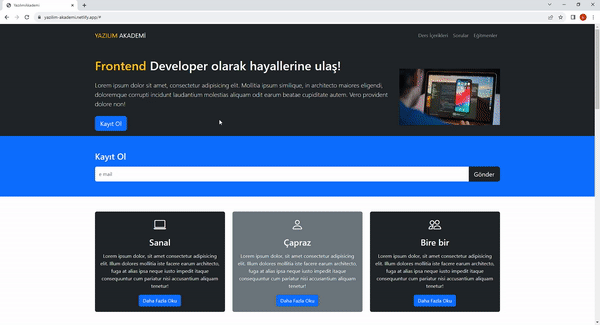

<h1>Yazilim-Akademi Project</h1>

In the project I created, I worked on the website of a software academy. I added "course contents", "questions" and "instructors" sections to the functional navbar. I created the registration button and form. I added academy information and location information via Google Map to the bottom of the site.

<h2> Technologies I Use </h2>

I designed my project with HTML5,CSS3 and Bootstrap codes.

<h2>Screenshot</h2>

